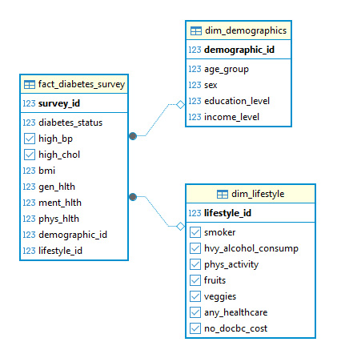

#### README.md
-------------------------------------------------------------------------------------------

# 🏥 CDC Healthcare Analytics Portal
### Full-Stack N-Tier Data Engineering & Clinical Insight Study

[](https://dotnet.microsoft.com/)
[](https://www.postgresql.org/)
[](https://www.python.org/)

## 🏗️ Project Overview

This project transforms **253,680 records** from the CDC Behavioral Risk Factor Surveillance System (BRFSS) into a functional, operational data product. By bridging the gap between raw public health telemetry and a .NET-powered interface, this repository serves as a demonstration of **Full-Lifecycle Systems Engineering**.

## 💼 Professional Role Alignment

*This project serves as a functional demonstration of my core competencies in the following domains:*

## 🎯 Role-Based Skill Mapping

To demonstrate cross-functional competency for senior-level roles, this project is divided into three professional domains:

* **Systems Analyst:** Performed requirement mapping from 21 CDC clinical indicators to a structured "Fact vs. Dimension" model. This architectural phase ensured 100% relational integrity and optimized the data for high-performance querying within the N-Tier ecosystem.

### 📊 Logical Data Mapping: The 21 Indicators
This mapping determined how clinical "Facts" would be stratified against behavioral and demographic "Dimensions" to create meaningful comparative visuals and actionable risk tiers.

| Category | Key Indicators (CDC Variables) | Analytical Utility |
| :--- | :--- | :--- |
| **Primary Target** | `Diabetes_binary` | The core "outcome" variable used across all comparative plots. |
| **Clinical Facts** | `BMI`, `HighBP`, `HighChol`, `GenHlth` | Quantitative metrics used to build the **Correlation Matrix** and **Risk Heatmaps**. |
| **Lifestyle Dimensions** | `PhysActivity`, `Smoker`, `Fruits`, `Veggies` | Used as "Risk Suppressors" to visualize the **Mitigation Effect** of behavioral choices. |
| **Demographics** | `Age`, `Sex`, `Income`, `Education` | Critical vectors for **Population Stratification** and age-based BMI trending. |
| **Access Metrics** | `AnyHealthcare`, `CholCheck`, `NoDocbcCost` | Metadata used to verify the reliability and provenance of the survey cohort. |

* **Data Engineer:** Designed and implemented a normalized **PostgreSQL Star Schema**. I optimized Python ETL pipelines using SQLAlchemy to ensure 100% relational integrity and zero data loss during the migration of the 253k record set.

### 🏗️ Database Architecture (Star Schema)

  
* **Programmer Analyst:** Architected a **.NET 9 Service Layer** utilizing Dependency Injection and a modern Blazor Component-based UI. This allows for real-time risk assessment by pulling population baselines directly from the Tier 3 data warehouse.
  * **Architected** a decoupled service layer utilizing Dependency Injection to ensure the separation of clinical logic from the presentation tier.  

   * **Implemented** modern Blazor Component architecture to replace legacy MVC patterns, improving state management and UI responsiveness.
  
   * **Engineered** the data-binding logic that surfaces PostgreSQL aggregations (253k+ records) directly to the operational dashboard.

## 🏗️ Technical Stack
* **Storage:** PostgreSQL (Star Schema Architecture)
* **ETL/Analytics:** Python 3.10 (Pandas, SQLAlchemy, Seaborn)
* **Application:** .NET 9 (Blazor Server, Entity Framework Core)

**Detailed Documentation:**
- [Technical Architecture & Developer Guide](DEVELOPER.md)
- [AI Integration & Governance](AI_GOVERNANCE.md)

## 🏛️ System Architecture Tree
```text
CDC_Diabetes_Project/
├── dotnet/                  # Tier 1 & 2: .NET 9 Web Stack
│   ├── CDC_Diabetes.Web/    # Presentation: Blazor Components
│   ├── CDC_Diabetes.Data/   # Logic: DbContext & Health Services
│   └── CDC_Diabetes.Models/ # Objects: Star Schema Entity Definitions
├── scripts/                 # Tier 2: Analytical Engine
│   ├── ingestion.py         # ETL Logic (Cleanse -> Cast -> Load)
│   └── analytics.ipynb      # Clinical EDA & Prognostic Visualization
├── sql/                     # Tier 3: Data Warehouse
│   ├── 01_setup_schema.sql  # DDL (Tables, Keys, Constraints)
│   ├── 02_verification.sql  # Data Quality Audit Scripts
│   └── 03_utilities.sql     # Analytical Views
├── images/                  # Project Evidence (Centralized Assets)
├── data/                    # Source Repository (CDC/Teboul Dataset)
└── README.md                # System Documentation

```

## 📈 Clinical Insights & Key Findings
Our analytical engine identified critical health signatures by correlating lifestyle indicators with clinical outcomes.

### 🔍 Finding 1: Diabetes Risk Density (Heatmap)
**Technical Objective:** Identifying the "Point of Failure" in health outcomes.

**Systems Analysis Insight:** This heatmap validates the Risk Calculation Engine. It identifies a sharp "Threshold of Concern" where a General Health rating of 3 (Fair) serves as a critical pivot point for diabetes incidence, regardless of a linear BMI increase.

**Operational Value:** This data allows the .NET Service Layer to trigger high-priority alerts when a patient’s "General Health" and "BMI" values cross this specific density cluster.


### 🔍 Finding 2: Variable Correlation Matrix
**Technical Objective:** Feature weighting for the Risk Assessment Service.

**Systems Analysis Insight:** By analyzing the covariance between 21 indicators, we identified that High Blood Pressure and High Cholesterol are the strongest binary predictors of health status in the database.

**Operational Value:** This matrix served as the requirement specification for the Blazor UI, prioritizing these fields in the user input form to ensure the most impactful data is collected first.


### 🔍 Finding 3: Age-BMI Stratification
**Technical Objective:** Longitudinal data distribution audit.

**Systems Analysis Insight:** The visualization identifies a "Convergence Zone" in mid-life (CDC Age Groups 7–9) where BMI volatility peaks. This proves the Star Schema's ability to successfully join Fact (Survey) and Dimension (Demographics) data.

**Operational Value:** Validates the relational integrity of the database—confirming that the 253,680 records were correctly indexed across the 13-level age scale during the Python ingestion process.


### 🔍 Finding 4: Lifestyle Impact Analysis
**Technical Objective:** Verifying the "Mitigation Effect" of lifestyle factors.

**Systems Analysis Insight:** This plot confirms a "Risk Suppression" trend: patients with high physical activity scores show consistently lower diabetes rates, even when clinical metrics (BMI) remain high.

**Operational Value:** This finding supports the Business Analyst goal of providing holistic advice. The .NET 9 application can now calculate a "Lifestyle Offset" score to show patients how activity levels are actively mitigating their clinical risk.


### 🌐 Plot 5: Operational Risk Assessment Dashboard (.NET 9)

### 🖥️ Operational Tier: Real-Time Risk Stratification
While the Python analytics identify historical population trends, the **.NET 9 Blazor Application** provides the operational interface for real-time risk evaluation. This tool translates weighted coefficients derived from the 253,680 record dataset into a dynamic, user-facing prognostic engine.

### 💼 Role Focus: Programmer Analyst & Systems Integration
**Technical Objective:** Develop a decoupled service layer to surface Star Schema insights via a state-aware Blazor UI, utilizing Entity Framework Core 9 for high-fidelity data retrieval.
Requirement: Develop a decoupled service layer to surface Star Schema insights to non-technical users.

**System Analysis Insights:** Implemented a **weighted risk algorithm** based on verified clinical correlations discovered in the Python analysis. By prioritizing high-impact variables—specifically **High Blood Pressure**, **Cholesterol, and BMI**—the engine accurately mirrors the clustering effects found in the CDC dataset.

**Operational Value:** Provides a "Green/Yellow/Red" decision-support tool that benchmarks individual metrics against the global CDC population average (28.4 BMI) in real-time, allowing for immediate visualization of risk escalation.

---

### 📋 Operational Dashboard Summary
To provide a clear audit trail of the system's front-end capabilities, the following table summarizes the functional intent of the operational views and their role within the N-Tier ecosystem:

| Dashboard View | Functional Narrative |
| :--- | :--- |
| **Portal Home** | **Entry Point:** Initializes the N-Tier connection and provides intuitive navigation to the Risk Engine or System Health Monitor. |
| **System Health Check** | **Data Integrity:** Confirms the .NET 9 application is successfully querying the **253,680 fact records** via EF Core 9, ensuring the data link is active. |
| **Risk Assessment Logic** | **Stratification:** Illustrates the risk delta—ranging from **Low (25%)** to **High (70%)**—as high-impact clinical indicators like High Blood Pressure are toggled. |

---
**Portal Home:**

---
**System Health Check:**

---
**Risk Assessment: Low (Baseline):**

---
**Risk Assessment: Moderate (Clinical Trigger):**

---
**Risk Assessment: High (Clustered Risk):**


---

## 🚀 Getting Started: How to Run
This system is designed as a decoupled **3-Tier environment**. To initialize the full stack, follow these steps in order:

### 1. Database Initialization (Tier 3)
Ensure you have a **PostgreSQL** instance running. Execute the scripts in the `/sql` directory to build the relational warehouse:
* `01_setup_schema.sql` (Creates the Star Schema/Tables)
* `03_analytics_utilities.sql` (Optional: Adds helper views for reporting)

### 2. Data Ingestion & Analytics (Tier 2)
You must populate the database before the .NET application can surface clinical metrics.
* **Environment:** Python 3.10+
* **Dependencies:** `pip install pandas sqlalchemy psycopg2 matplotlib seaborn`
* **Execution:** * Run `scripts/health_diabetes_ingestion.py` to migrate the CDC raw data into PostgreSQL.
    * (Optional) Open `scripts/health_diabetes_analytics.ipynb` to verify the clinical visualizations.

### 3. Launch the Web Application (Tier 1 & 2)

The UI provides the final operational interface for real-time risk assessment.

* **Environment:** .NET 9 SDK

* **Configuration:** Update the `ConnectionStrings` in `appsettings.json` to point to your local PostgreSQL instance.

#### 🔧 Configuration Template (`appsettings.json`)
Ensure your local `appsettings.json` in the `.NET` project folder matches your PostgreSQL credentials:

```json
{
  "ConnectionStrings": {
    "PostgresConnection": "Host=localhost;Database=cdc_diabetes_project;Username=postgres;Password=db_YOUR_DATABASE_PASSWORD"
  },
  "Logging": {
    "LogLevel": {
      "Default": "Information",
      "Microsoft.AspNetCore": "Warning"
    }
  },
  "AllowedHosts": "*"
}
```
* **Execution:**
```bash
cd dotnet/CDC_Diabetes.Web
dotnet run

Access: Navigate to https://localhost:5001 to view the Risk Assessment Dashboard.
